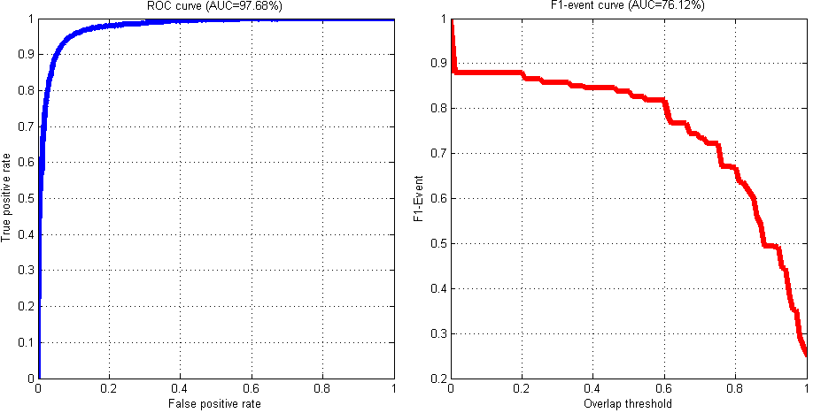

Metrics for Event Detection
===========================

Below is a collection of metrics we applied for report facial action unit (AU) results.  However, these metrics can be used for evaluating various applications involving object or event detection.

1. [ROC curve](https://en.wikipedia.org/wiki/Receiver_operating_characteristic) and its area under the curve
2. [Frame-based F1 score](https://en.wikipedia.org/wiki/F1_score)
3. [Skew-normalized F1 score](https://en.wikipedia.org/wiki/F1_score)
4. [Event-based F1-score](http://www.cv-foundation.org/openaccess/content_iccv_2013/papers/Ding_Facial_Action_Unit_2013_ICCV_paper.pdf)



More info:

- **Links**: [ [paper](http://www.cv-foundation.org/openaccess/content_iccv_2013/papers/Ding_Facial_Action_Unit_2013_ICCV_paper.pdf) ]
- **Contact**:  Please send comments to Wen-Sheng Chu (wschu@cmu.edu)  
- **Citation**: If you use this code in your paper, please cite either of the following:
```
@inproceedings{ding2013facial,
  title={Facial Action Unit Event Detection by Cascade of Tasks.},
  author={Ding, X. and Chu, W.-S. and {De la Torre}, F. and Cohn, J. F. and Wang, Q.},
  booktitle={ICCV},
  year={2013}
}
```
```
@article{ding2016cascade,
  title={Cascade of Tasks for Facial Expression Analysis},
  author={Ding, X. and Chu, W.-S. and {De la Torre}, Fernando and Cohn, J. F. and Wang, Q.},
  journal={Image and Vision Computing},
  year={2016},
}
```

Contents
========

The project tree is organized as follows.

    func/           directory for utility functions
    README.md       this file
    demoMet.m       demo of metrics given a ground truth label and a prediction

Usage
=====

In Matlab shell:

    >> cd metrics
    >> demoMet

Given that the ground truth annotation ```label``` and predicted decision value ```decV``` are vectors of the same length , the function signature for different metrics are as follows:

1. ROC: ```metR = getROC(label, decV)```
2. F1-frame: ```metF = getF1F(label, decV)```
3. F1-norm: ```metN = getF1N(label, decV)```
4. F1-event: ```metE = getF1E(label, decV)```

The script has been tested on Windows 8, Ubuntu 3.11.0 and Mac X 10.9.4 without problems. 
Please send your feedbacks to [Wen-Sheng Chu](mailto:wschu@cmu.edu) regarding any issues, bugs and improvements. 

License
=======

The code may be redistributed under BSD license.
Please send your feedbacks to [Wen-Sheng Chu](mailto:wschu@cmu.edu). :)

